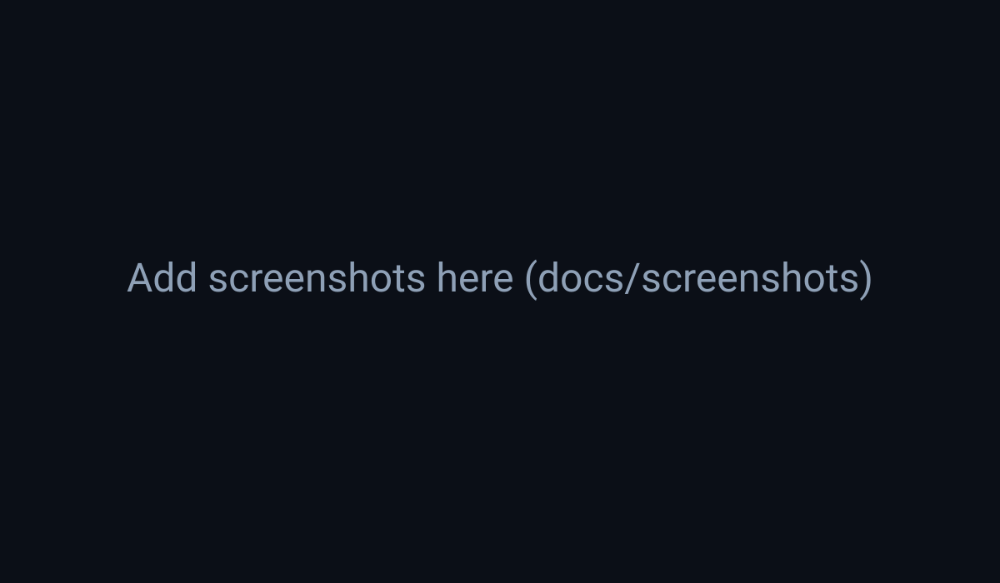

# BarrelTracker

BarrelTracker is a **fully offline** barrel performance tracker. Import sessions, rank barrels, and review trends — all in a single HTML file (no external dependencies).

## Run it
- **Live (GitHub Pages):** https://mrimp.github.io/BarrelTracker/
- **Offline:** download `BarrelTracker_LATEST.html` from this repo (or a release ZIP) and double-click (Chrome/Edge recommended).

## Screenshots
> Replace these placeholders by dropping images into `docs/screenshots/`.

## Offline reliability
- **No network calls:** this build blocks `fetch`, `XMLHttpRequest`, `WebSocket`, and `sendBeacon` and logs attempted calls.
- **Offline Self-Test:** open **Guide → Offline Self‑Test** to confirm:
  - no network calls attempted
  - no remote `src/href` assets
  - localStorage read/write OK
- **Portable mode:** open **Guide → Portable mode** to export/import a single JSON bundle (data + UI settings) for moving between machines/browsers.

## Known limitations / browser notes
See: [`docs/KNOWN_LIMITATIONS.md`](docs/KNOWN_LIMITATIONS.md)

## Versioning & releases
- Semantic Versioning: `MAJOR.MINOR.PATCH`
- Tag flow: bump version + changelog → tag `vX.Y.Z` → GitHub Release

Docs:
- [`docs/VERSIONING.md`](docs/VERSIONING.md)
- [`docs/RELEASE_CHECKLIST.md`](docs/RELEASE_CHECKLIST.md)

## License
MIT — see [`LICENSE`](LICENSE).
